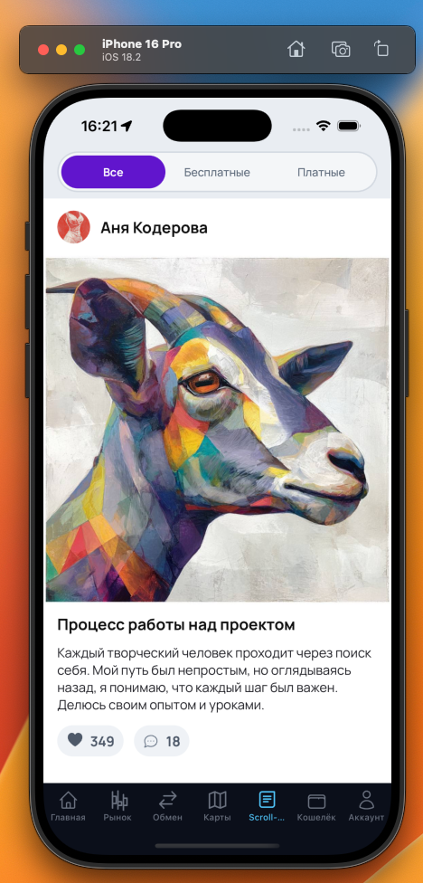

# React Native Posts App

Приложение на **Expo + Expo Router** (React Native) с лентой постов и экраном поста.

## Видео демо

[Запись экрана (Google Drive)](https://drive.google.com/file/d/1gxUAoV2EhrgASxG239NFSmi4rBl9wC46/view?usp=sharing)

## Как работает открытие поста

- В приложении есть **лента постов**.
- При нажатии в карточке поста на кнопку **комментариев** (иконка чата) открывается **отдельный экран поста**.
- На экране поста можно **прочитать пост** и **посмотреть/написать комментарии**.

## Требования

- **Node.js** (рекомендуется LTS)
- **npm**
- Для запуска на устройстве: приложение **Expo Go**
- Для эмуляторов:
  - **iOS**: Xcode
  - **Android**: Android Studio

## Установка

```bash
npm install
```

## Запуск

Запуск дев-сервера:

```bash
npx expo start
```

Дальше можно открыть приложение:

- **Expo Go**: отсканируй QR-код камерой (iOS) или в Expo Go (Android)
- **iOS Simulator**: нажми `i` в терминале (или выбери в интерфейсе Expo)
- **Android Emulator**: нажми `a`
- **Web**: нажми `w`

## Полезные команды

Проверка линтера:

```bash
npm run lint
```

Запуск платформ:

```bash
npm run ios
npm run android
npm run web
```

## Пример



## Вариант с полноценным окружением и авторизацией

Есть вариант решения с **полноценным развернутым окружением** (бэкенд + база данных) и **авторизацией** (логин/токен), чтобы посты и комментарии загружались с сервера, а доступ к закрытому контенту зависел от пользователя.
